# Windrose Character Editor

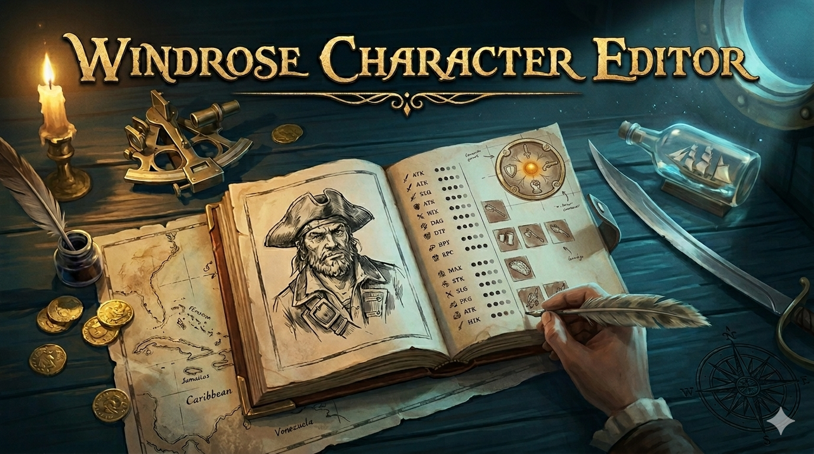

A save-game editor for [Windrose](https://store.steampowered.com/app/3349750/Windrose/) (Early Access). Edit your character's level, XP, stats, talents, inventory, ships, recipes, and discoveries — without touching the save files by hand.

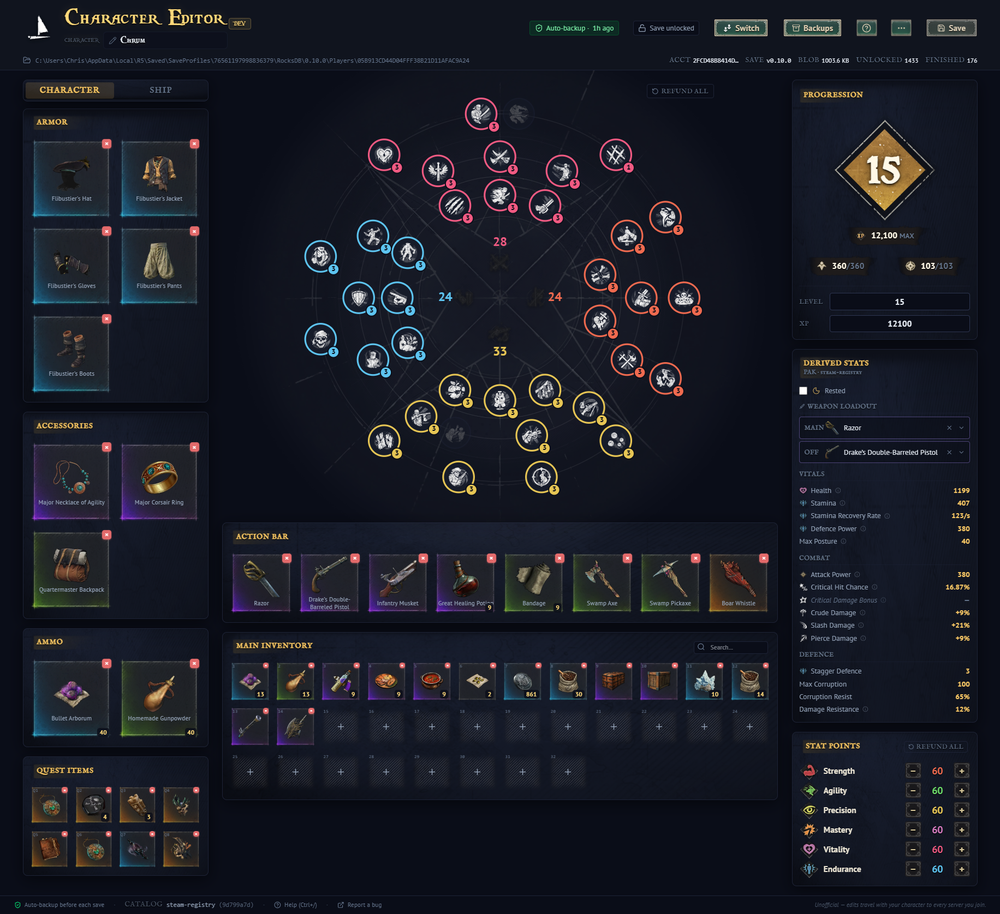

---

## ⚠ READ FIRST: Disable Steam Cloud for Windrose

Since the May 4 game patch, Windrose's saves are managed by an internal checkpoint system. **If Steam Cloud is enabled, your edits will silently revert on the next game launch.**

**To disable:** Steam → right-click Windrose → Properties → General → uncheck *"Keep game saves in the Steam Cloud"*. If Steam asks about a conflict, pick *"Use Local files"*.

This is a one-time setting. Without it, the editor cannot reliably persist changes.

---

## Quick install

Download from the [latest release](https://github.com/Chris971991/windrose-character-editor-releases/releases/latest):

| File | What it is |
|---|---|
| `Windrose-Character-Editor-X.Y.Z-x64.exe` | **Installer** (recommended) — install wizard, Start Menu + desktop shortcuts, sets up auto-updates. Per-user install, no admin required. |
| `Windrose-Character-Editor-X.Y.Z-portable-x64.exe` | **Portable** — single .exe. Run from anywhere (incl. USB drives), no install. Will not auto-update — download future versions manually. |

> **First-run SmartScreen warning**: Windows will say *"Windows protected your PC"* the first time. Click **More info** → **Run anyway**. The app is currently unsigned; this warning is normal for early indie releases.

You don't need Node.js, Python, .NET, or any modding tools. Just Windrose installed via Steam.

---

## What it can do

- **Character**: rename, change level + XP, edit all 6 stats (Strength / Agility / Precision / Mastery / Vitality / Endurance), assign points across the talent tree
- **Inventory**: swap any item, change quantities, change equipment level (1–max quality), set up the action bar and main inventory exactly how you want
- **Ships**: rename ships, swap hulls, edit cannons / hull plate / boarding crew / sails / flags / hull colors, manage cargo and consumables, set the flagship, repair damaged ships, add new ships to your fleet, delete ships you don't want
- **Recipes**: toggle every recipe paper your character has learned across cooking, alchemy, building, ship gear, and more. Search, filter by category, bulk-unlock entire categories
- **Discovery**: track every biome's discoveries (89 entries across Coastal Jungle, Foothills, Cursed Swamps, Ashlands). Layout matches the in-game UI exactly — same sections, same order, same boss progression locks (defeat the previous boss to unlock the next biome). Hover any tile for full game description, effects, vanity text. Bulk actions auto-skip locked biomes. Ashlands shows "Coming Soon" with an animated hourglass since the devs haven't released its content yet
- **Live derived stats**: as you edit, the right-side panel recalculates Health, Stamina, Defence Power, Critical Hit Chance, weapon damage, etc. using the game's actual PAK-derived math — so you can see the real impact of every change before you save
- **Undo / redo**: every edit is history-tracked. Slider drags collapse into one undo step.
- **Build presets**: export your current edits as a JSON file you can share with friends or re-apply later
- **Backups**: pre-save auto-backup, restore-with-preview, per-row notes, one-click prune, restore-with-safety-snapshot
- **Hot-patch catalog**: when Windrose patches between editor releases, the editor pulls fresh PAK data from GitHub on demand, so you don't have to wait for a new build
- **Auto-updates**: opt-in update prompts via GitHub releases; no telemetry, no phone-home

---

## Getting started

1. **Disable Steam Cloud for Windrose** (see warning at the top of this page). Without this, your edits silently revert on next game launch.
2. **Close Windrose.** The editor refuses to write while the game has the save file open. The header shows a yellow *"Game running — close to save"* pill when this is the case.
3. **Open the editor.** It auto-detects your save in `%LOCALAPPDATA%\R5\Saved\SaveProfiles\<your-Steam-ID>\…`. If you've never run Windrose on this PC, you'll get a recovery screen explaining where the save is expected.
4. **First launch shows a welcome screen** covering auto-backup, the lock-while-game-running rule, and a heads-up that edited gear travels with your character to any shared server you join. Click *I understand* once and it stays out of the way.
5. **Make an edit.** Try something small first — bump your level by 1, or add a stat point — and verify it shows up in-game before doing anything bigger.
6. **Click Save** (or press **Ctrl+S**). The header turns the Save button gold when you have unsaved changes. The editor takes a backup automatically before writing, then commits.
7. **Launch Windrose** and confirm the changes landed.

Your character (stats, talents, inventory, ships) is stored locally and persists across solo and multiplayer sessions, so anything you edit here comes with you when you join a friend's world or a community server. Be considerate of other players and follow each server's rules.

If you have multiple Windrose characters on this PC, the editor opens a picker on first launch so you can choose which one to load (and optionally pin a default for next time):

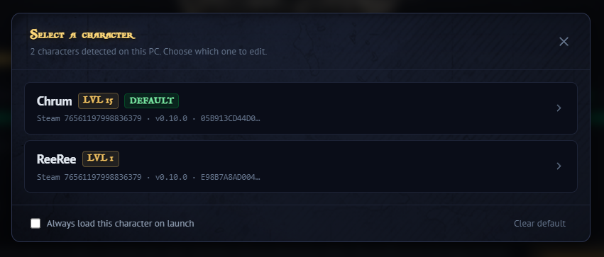

---

## Header

The top bar holds the bread-and-butter controls.

| Element | What it does |
|---|---|
| Windrose logo + **Character Editor** title + version chip | Quick visual confirmation of which version you're running |
| **Character name** pill (with pencil icon) | Click to rename your character — commits on Save |
| **Update pill** | Appears when a newer release is available; opens an Update modal so you can choose to download |
| **Catalog update pill** | Appears when fresher game-data is available between editor releases |
| **Auto-backup pill** | Green pill near the Save button showing the time since your last backup ("just now", "12m ago", …) so the safety net is always visible |
| **Lock indicator** | Green *"Save unlocked"* when the game is closed; amber *"Game running — close to save"* when it isn't |
| **Switch character** | Visible when you have multiple Windrose characters detected — switch save mid-session |
| **Backups** | Opens the backups browser (also Ctrl+B) |
| **Activity bell** | Recent toast history (last 50) — see what just happened if a notification scrolled past |
| **Help (?)** | Opens the Help / About modal (also Ctrl+/) — keyboard shortcuts, file locations, catalog version, GitHub link, power tools |
| **More menu (…)** | Undo / Redo / Reload from disk / Discard all edits |
| **Save** | Writes pending edits to disk. Disabled while the game is running or there's nothing to save. |

Below the buttons: full save path with a click-to-open-folder button, plus account ID, save version, blob size, and your current recipe-unlock counts — at-a-glance reference info.

---

## Keyboard shortcuts

| Shortcut | Action |
|---|---|
| **Ctrl + S** | Save edits to disk |
| **Ctrl + Z** | Undo last edit |
| **Ctrl + Y** (or **Ctrl + Shift + Z**) | Redo |
| **Ctrl + B** | Open backups |
| **Ctrl + R** | Reload from disk (discards unsaved edits) |
| **Ctrl + /** | Open Help / About |
| **Esc** | Close any open modal |
| **/** | Focus search inside the item picker |

---

## Character tab

The bigger of the two tabs. Three-column layout.

### Left column — Equipment

Click any slot to open the **Item Picker** (see below). Slots are organised:

- **Armor** (5): Head, Torso, Hands, Legs, Boots
- **Accessories** (3): Necklace, Ring, Backpack
- **Ammo** (2): Projectiles, Gunpowder

Each slot shows the item's icon, name, count badge if stacked, and a small gold dot when you have unsaved changes. Hover for a full info popover. The **×** in the top corner clears the slot.

### Middle column — Talent radial + Action bar + Main inventory

**Talent radial** — the big circular tree at the top, modeled after the in-game version. Four branches (Fencer / Crusher / Marksman / Toughguy) at 4 compass points.

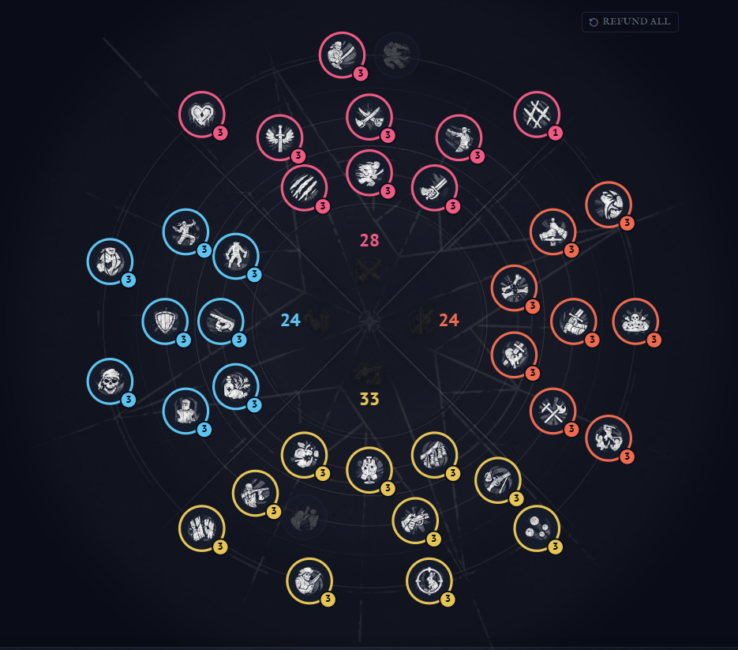

- **Left-click** a talent dot to add a rank (capped at the talent's max, usually 3)
- **Right-click** a talent dot to remove a rank
- **Multi-perk talents** (the ones with a circular split): clicking a different perk switches your active perk to it at rank 1
- Branch totals are shown at each branch's centre — useful for tracking ring-2 / ring-3 requirements
- Locked talents (greyed out) need more points spent in the same branch first
- **Refund all** button (top-right of the radial, shown when you've spent at least one point) drops every talent to 0 in one click

Hovering any talent shows the current and next-rank effect side-by-side so you can see exactly what spending a point will get you:

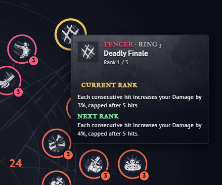

**Action bar** (8 slots) — your hotbar. Holds consumables, potions, throwables, weapons.

**Main inventory** (32 slots) — everything else. Stack-able items (food, resources, ammo) show a count badge. **Search box** in the card header dims non-matching slots so you can find items in a busy bag without losing layout.

For any slot, click to swap, edit count, or change the item level (for equipment with quality tiers).

### Right column — Progression + Derived stats + Stats

**Progression** card

- Level rhomb showing current level, with XP fill rising as you approach the next threshold
- Level + XP number inputs (free-edit, no spending budget enforced)
- **Stat Points** and **Talent Points** spent / budget readouts

**Derived Stats** panel — live-computed from your character + talents + equipped gear, using the game's actual math from the PAK files. As you edit anything in the middle panel, these update instantly:

- **Vitals**: Health, Stamina, Stamina Recovery Rate, Defence Power, Max Posture
- **Combat**: Attack Power, Critical Hit Chance, Critical Damage Bonus, Crude / Slash / Pierce damage modifiers
- **Defence**: Stagger Defence, Max Corruption, Corruption Resist, Damage Resistance, etc.

A small **PAK · bundled / hot-patch** chip in the corner tells you which catalog source the values came from.

**Available Stat Points** — the 6 stats with `−` / `+` buttons. Free-edit; the editor doesn't enforce the in-game spending order. **Refund all** button drops every stat back to 0 in one click (refunds the points into the pool).

---

## Ship tab

Switch via the *Character ⇄ Ship* tab pill at the top of the left column.

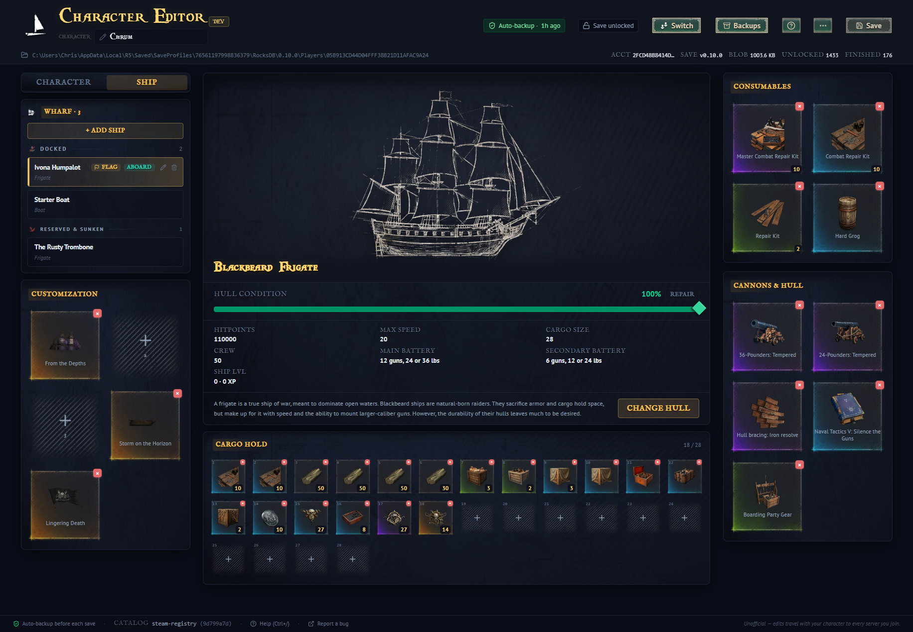

### Left column — Wharf (your fleet)

Two sections:

- **Docked** — ships that are deployed to islands in your world
- **Reserved & Sunken** — freshly-crafted ships, ships in storage, ships you've recovered from sinking

Each row shows the ship name, hull type, health, and badges for *Flagship* / *Aboard* / damage status. Click a row to load it for editing. Hover the pencil icon to rename inline.

**`+ Add ship`** opens a hull picker. Choose a hull, optionally name it, and the editor creates a fresh ship that lands in *Reserved & Sunken* — same state as if you'd just crafted one in the game's shipyard. The matching internal building entry is also created so the game treats it like a real ship.

**Repair All** appears whenever any ship has less than 100% HP. One click restores everyone.

Some ships can't be deleted from the editor: the starter Boat, your current flagship, and the ship you're currently sailing.

### Center / right — Ship detail

When a ship is selected:

- **Blueprint hero card** — large hull artwork, name (renameable), health bar, *Change hull* button, *Delete ship* button
- **Cannons & Hull** (4 slots): Big cannon, Small cannon, Hull plate, Boarding crew
- **Customization** (3 slots): Sails, Hull color, Flag (cosmetic — no level editing)
- **Consumables** (4 slots): Quick-use items the crew can deploy
- **Cargo Hold** (28 slots): general ship storage

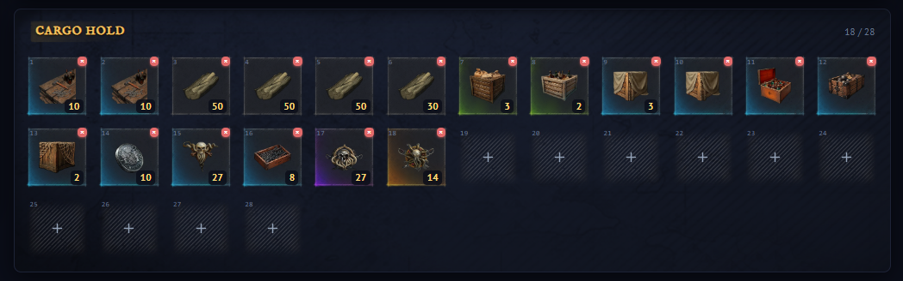

All slots open the same Item Picker as the character side.

### Customization picker

Sails, hull colors, and flags each have their own dedicated picker, organised by faction pack (Stock, Brethren, Blackbeard, Buccaneers, Smugglers, Corsairs, etc.) so you can mix-and-match looks across faction style books you've unlocked.

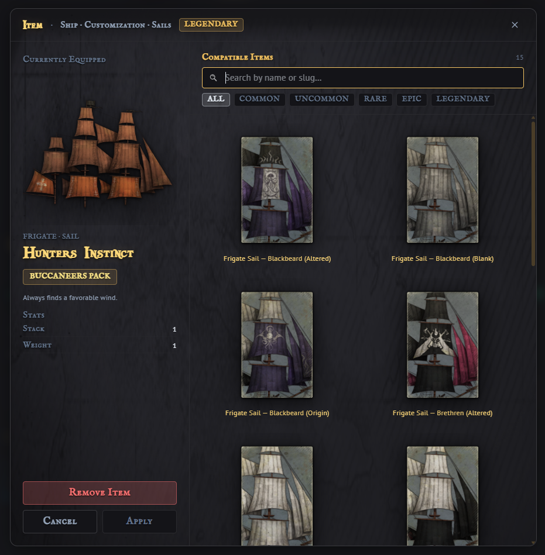

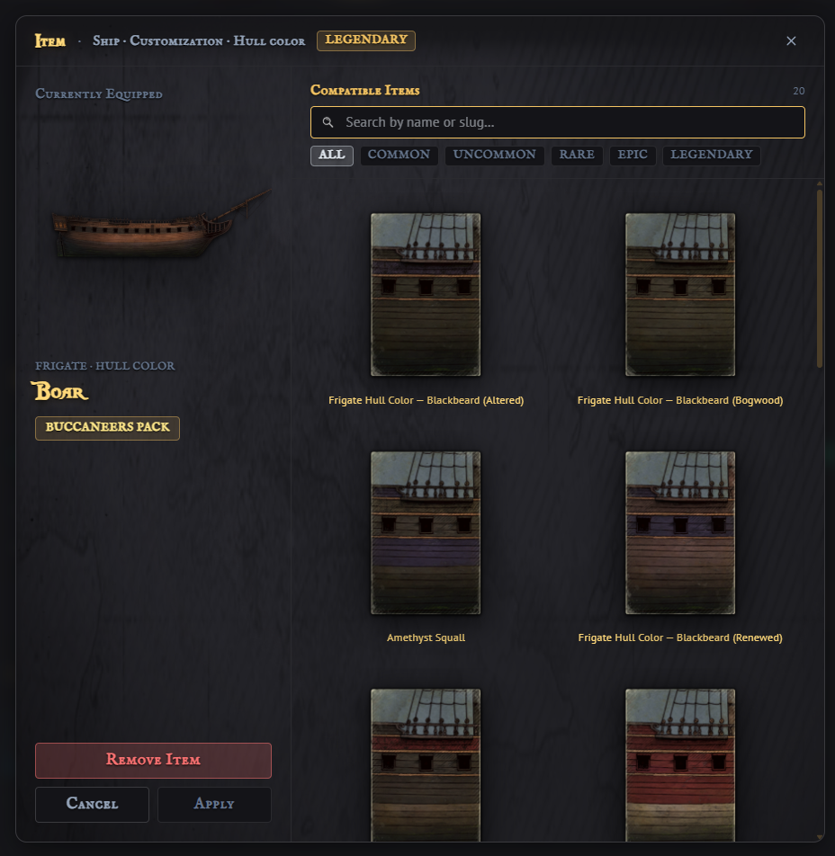

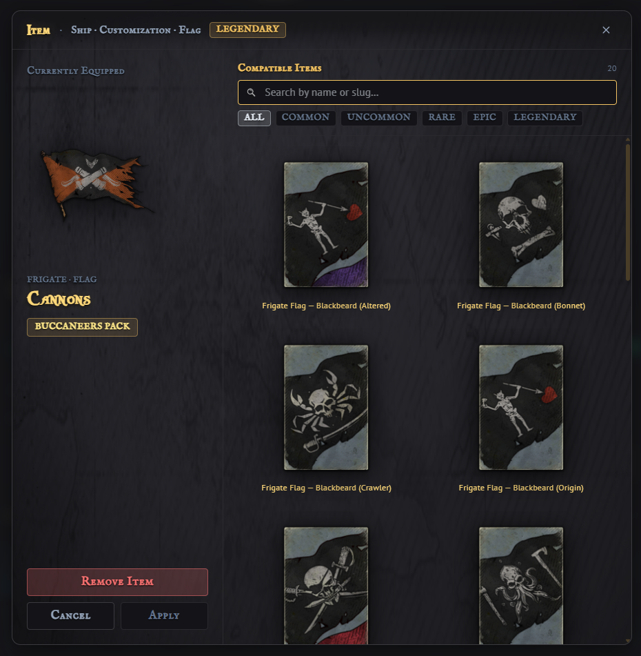

---

## Recipes tab

Toggle every recipe paper your character has learned. Useful for unlocking hard-to-find recipes, restoring a corrupted recipe list, or sharing a "fully unlocked" character with friends.

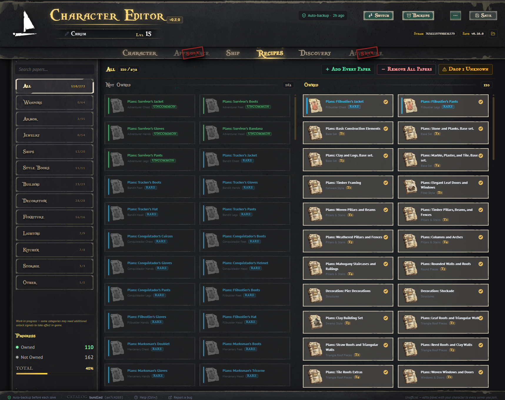

The catalog covers cooking, alchemy, building, ship gear, and more. Each recipe row shows the recipe name, category, and a tri-state indicator (locked / unlocked / synthetic). Search filters by name; category chips at the top scope the visible list.

**Bulk actions**:
- **Unlock all** in the visible filter (e.g. all cooking recipes)
- **Reset all** to vanilla (drops every learned recipe — useful for "start fresh" runs)
- **Drop unknown** — strips orphan recipe entries from older game versions that no longer exist in the current PAK

Inventory recipe papers (those `did_misc_recipepaperunlock_*` items in your bag) are **read-only in this editor**. Sorting your bag in-game with these papers can crash the game (a Windrose bug), so the editor refuses to drop, transfer, or delete them — instead, drop them in-world and pick them back up in-game to learn the recipe and remove the crash risk.

---

## Discovery tab

Track every biome's discoveries — same sections, same order, same boss progression locks as the in-game UI.

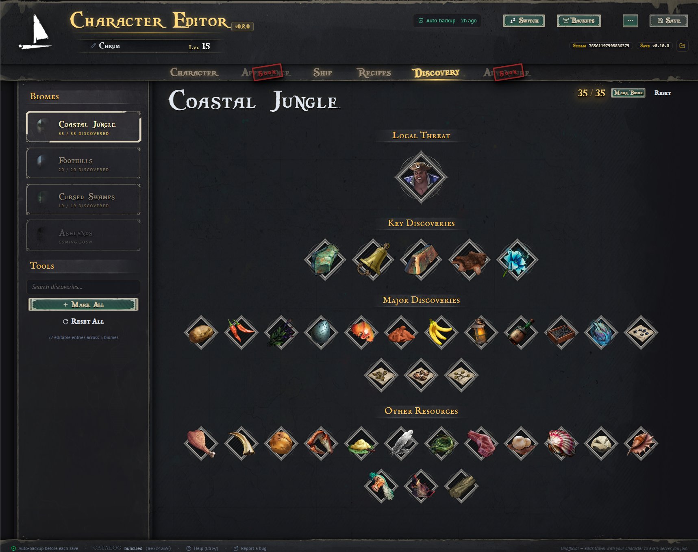

**Four biome cards** (Coastal Jungle, Foothills, Cursed Swamps, Ashlands), each with up to four sections:

- **Local threat** (boss tile, biggest)
- **Key discoveries** (workstation unlocks)
- **Major discoveries** (paper-driven recipes)
- **Other resources** (basic loot — vine, wood, stone, conch, crab claw, etc.)

Click any tile to toggle between Discovered ↔ Not started. Right-click for the tri-state picker (None / Partial / Discovered, plus the optional "Found in world" flag for entries that track it). Hover any tile for a rich tooltip showing the full game description, effects, rarity, and vanity text — same visual style as the equipment picker.

**Boss tiles** show a portrait + short lore: Boatswain (Coastal Jungle), Israel Hands (Foothills), Tainted Priestess (Cursed Swamps).

**Progression locks** match the in-game UI: each biome stays locked until you defeat the previous biome's boss. The lock clears the moment you mark the boss as Discovered — no save required. **Ashlands** is locked separately ("Coming Soon" with an animated hourglass) since the devs haven't released its content yet, but you can still hover its tiles to preview what's coming.

**Bulk actions**:
- **Mark all** / **Reset all** affect every editable biome at once. Smart enough to skip Ashlands (locked content) and tell you the actual scope ("across 3 unlocked biomes")
- **Per-biome buttons** in each card's header for Mark biome / Reset biome
- **Search filter** dims non-matching tiles

---

## Item Picker

The popup that appears when you click any slot. Same control across character and ship tabs.

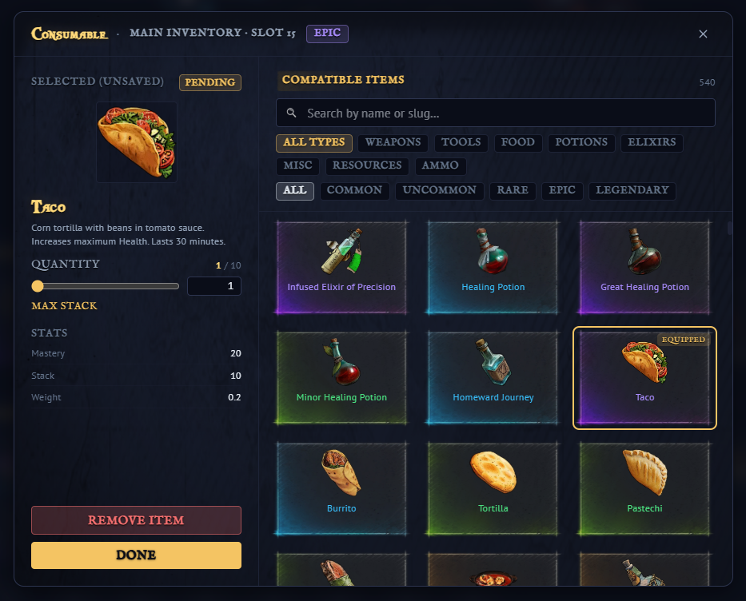

Hovering an item in your inventory shows the full effect breakdown plus stats at your current level (with the **base → your level → max** range so you can see what you have and what you'd gain by upgrading):

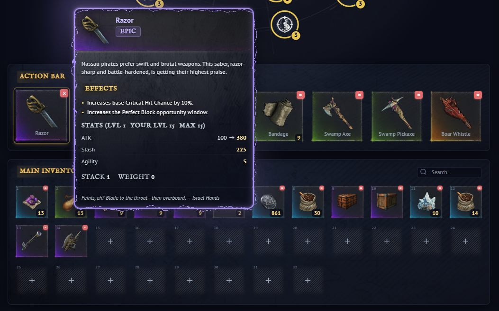

**Left side** — what's currently in this slot

- Item icon, name, description (the in-game flavor text)
- **Item Level** slider (for items with quality tiers): drag from 1 to max, or use the Min / Max quick buttons
- **Quantity** slider (for stackable items): drag or type a number. Editor will warn if you go above the in-game stack cap.
- **Remove item** clears the slot
- **Done** commits your selection to your pending edits (still need to click **Save** in the header to actually write to disk)

**Right side** — compatible items

- **Search bar** (matches name, slug, or description) — auto-focuses when the picker opens, also bound to **/**
- **Type** filter (All Types / Weapons / Tools / Food / Potions / Elixirs / Misc / Resources / Ammo) — only shows types relevant to the slot, with sub-category chips for the larger groups
- **Rarity** filter (Common / Uncommon / Rare / Epic / Legendary / Myth)
- 3-column grid of items. Hover any tile to see a full info popover with stats, effects, set bonuses, etc.

While the list loads, you'll see spinning loader tiles in the grid. The first time you open a picker per session takes a moment; after that it's instant.

---

## Backups

Click **Backups** in the header (or press **Ctrl+B**) to open the browser.

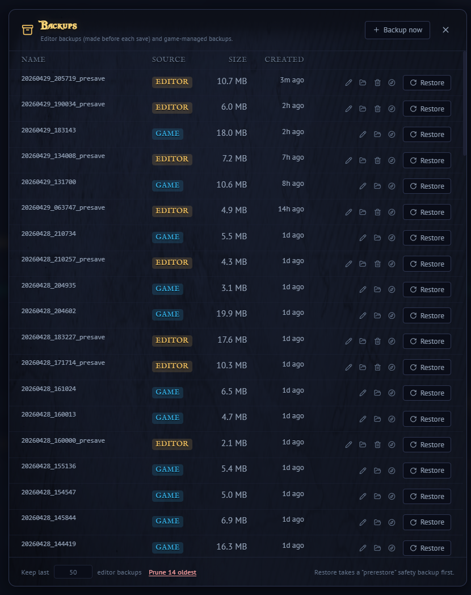

Two sources of backups appear:

- **Editor** backups — automatic snapshots taken before every save the editor makes. Stored at `%LOCALAPPDATA%\R5\Saved\SaveProfiles\<SteamID>_Backups_Editor\<timestamp>\`.
- **Game** backups — Windrose's own auto-saves. Stored at `%LOCALAPPDATA%\R5\Saved\SaveProfiles\<SteamID>_Backups\`.

Each row supports:

- ✏️ **Add a note / rename** — tag the backup ("before respec", "L15 PvP build") so you remember what it was
- 🧭 **Preview** — show how this backup compares to your live save (name, level, XP, stat-point spend, talent-point spend) in a side-by-side diff before clicking Restore
- 📂 **Open folder in Explorer** — drill into the actual files
- 🗑 **Delete** — remove a single editor backup
- ⟲ **Restore** — overwrite the live save with this snapshot

When you restore:

1. The editor takes a fresh *prerestore* backup of your current state first (so you can undo the undo)
2. Copies the chosen backup over your live save
3. The editor reloads from disk

Restore is disabled while the game is running.

**Auto-prune**: configure how many editor backups to keep (default 50). When you exceed the limit, a "Prune N oldest" link appears in the footer. Click to delete the surplus in one go. Game-managed backups are never touched.

**Backup now**: the modal header has a *Backup now* button if you want to take a snapshot manually (e.g. before launching the game to test something risky).

---

## Help / About

The **(?)** icon in the header (or **Ctrl + /**) opens a modal with:

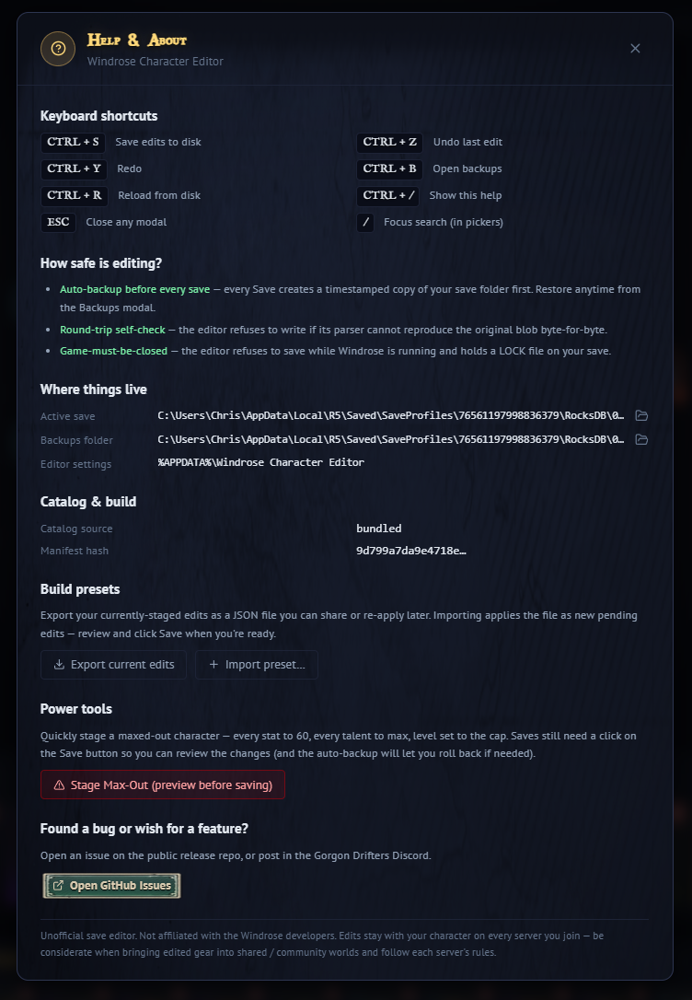

- **Keyboard shortcuts** reference
- **How safe is editing?** — auto-backup, round-trip self-check, game-must-be-closed
- **Where things live** — direct links to your save folder, backup folder, and editor settings folder, each with an Open-in-Explorer button
- **Catalog & build** — the active catalog source (bundled / hot-patch) and its manifest hash, useful when filing a bug report
- **Build presets** — export your current edits as a JSON file (`Export current edits`) or import a preset (`Import preset…`) to apply someone else's build to your character. Imports stage the edits as new pending changes — review and click Save when you're happy.
- **Save won't load?** — *"Repair save folder"* tool that diagnoses + fixes the most common post-patch issues (v1↔v2 mirror gaps, missing player directories, etc.)
- **Diagnostic log** — *"Download diagnostic log"* button. Drop the .log into your GitHub issue or Discord post when reporting bugs.
- **Power tools** — *Stage Max-Out* (level cap, every stat to 60, every talent maxed). Behind a danger-tone confirm; nothing is written to disk until you click Save.

  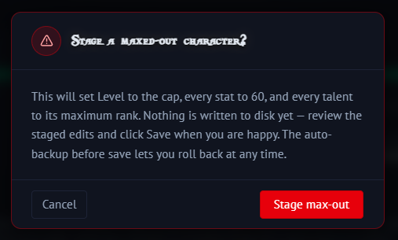
- **Found a bug?** — direct link to GitHub Issues.

---

## Auto-updates

The editor checks the GitHub release page on every launch and every 30 minutes thereafter.

- If you're on the latest version, no pill is shown
- If a newer version is available, the **Update modal** appears asking *Download &amp; install?* — opt-in. You'll see release notes for what's new before you commit. Click *Skip for now* if you'd rather not.
- During download you see progress; once finished, click *Install &amp; restart* and the editor swaps in the new version automatically. Native Windows toast notifications fire for new versions detected while the editor is open in the background.
- If a restart-to-update fails, you'll see a small red pill in the header instead of an OS pop-up. Auto-clears after a few seconds so you can retry.

The **catalog update pill** is independent of the editor version. When Windrose patches the game and a fresher set of stat curves is published, this pill appears so you can pull just the data without reinstalling. No restart needed — just click and reload.

The **portable .exe does not auto-update** — it's a single-file build. Download future versions manually from the release page.

---

## Safety

- **First-launch welcome modal** — explicitly explains auto-backup, the lock-while-game-running rule, the Steam Cloud requirement, and that edits travel with your character into any shared world you join. Acknowledged once and remembered.
- **Game-lock detection**: the editor checks for the RocksDB `LOCK` file before any save. If Windrose has the save open, the Save button is disabled and the header shows a *"Game running — close to save"* warning.
- **Pre-save backup**: every save creates a timestamped copy of the entire RocksDB tree (Accounts + Players) before writing. Visible age in the header pill near Save.
- **Round-trip self-check**: before applying edits, the editor's save layer parses the unmodified blob, re-serialises it, and bails if the bytes aren't identical. Catches parser bugs that would otherwise silently corrupt the save.
- **Save-error reporting**: if a save ever does fail, the editor offers to copy a diagnostic bundle (error message, catalog hash, edit summary) to your clipboard so you can paste it into a GitHub issue.
- **Field preservation**: the editor only mutates fields it understands. Polymorphic blobs, unknown nested arrays, and the persistent blackboard pass through untouched.
- **Equipment stack guard**: refuses to set count > 1 on equippable items (which use single-item slots) — prevents invalid stack states that would crash the game on next inventory open.
- **Asset-path validation**: every item path is checked against the game's actual asset manifest before saving. Invalid paths are rejected before they hit the disk.
- **Discard-edits guard**: switching characters or hitting *Discard all* with unsaved edits prompts an in-app confirm modal — no native browser pop-ups.

  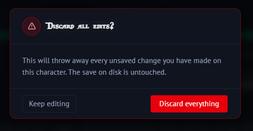

---

## Troubleshooting

**My edits silently revert when I launch Windrose** — Steam Cloud is enabled. See the warning at the top of this README. Disable it and your edits will persist.

**Editor says "Game running — close to save"** — Windrose still has the save file open. Quit the game completely (check the system tray and Task Manager if it's still running in the background).

**Editor can't find my save** — the editor shows a recovery screen explaining where it expects the save (`%LOCALAPPDATA%\R5\Saved\SaveProfiles\<SteamID>\`). Things to check:
- Have you launched Windrose at least once on this PC and saved in-game?
- Press *Win + R* and run `%LOCALAPPDATA%\R5\Saved\SaveProfiles` to look at the folder yourself.
- The editor's no-save screen has a **Browse for save folder** button if your save lives somewhere else (custom Steam library, backup folder).

**Migration-failed dialog when launching the game** — open the editor, click Help (?), then *Repair save folder*. The Diagnose-then-Repair flow heals the most common post-patch issues (v1↔v2 mirror gaps, missing player directories) non-destructively.

**SmartScreen blocks the .exe** — Click **More info** → **Run anyway**. The app is unsigned for now (code-signing certificate is on the to-do list).

**Auto-update isn't working** — Check `%APPDATA%\Windrose Character Editor\logs\main.log` for `[updater]` lines. The header pill should also show an error tooltip if the check fails. Failing that, just download the latest installer manually from the [release page](https://github.com/Chris971991/windrose-character-editor-releases/releases/latest) and run it over your existing install.

**The picker is slow to load the first time** — That's the per-item data hydration. Once loaded, it's instant for the rest of your session.

**Game rejects my edited character on a guild server** — Some servers run their own progression validation and may refuse a character whose stats look out of bounds. There's no single "fix" — talk to the server admin if you need their server to accept your character, or just play that character on a different server / in solo.

**My in-game level shows 14 but the editor shows 15 (or vice versa)** — The save stores levels 0-indexed, the in-game UI is 1-indexed. The editor follows the in-game convention. So if the editor says level 15, that's what the game also shows.

**A save failed and the editor asked to copy diagnostics** — that's the corrupt-save report path. Click *Copy diagnostics*, then paste into a new GitHub issue. The auto-backup before save means no data was lost.

---

## Compatibility

- **Game**: Windrose 0.10.0+ (Early Access). The editor's catalog auto-updates between game patches via the hot-patch system.
- **OS**: Windows 10 / Windows 11 (64-bit)
- **Game install**: Steam (any Steam library location works — the editor finds it automatically)

---

## Privacy & disclaimer

- **No telemetry, analytics, or phone-home behaviour.** The editor only contacts GitHub for update checks and gaming.tools for item icon / cosmetic-string fetches. All saves are processed locally on your machine.
- **Edits travel with your character.** Your character (stats, talents, inventory, ships) is stored locally and persists across every server you join, so anything you edit here comes with you. Be considerate of other players and respect each server's rules — ask the admin first if you're unsure.
- **Be cautious with big edits.** Start small (level +1, or a single stat point) and confirm the change works in-game before scaling up. The editor's safety net is the auto-backup, not a guarantee.

---

## Bug reports & feature requests

Open an [issue on this repo](https://github.com/Chris971991/windrose-character-editor-releases/issues). Include:

- Editor version (visible next to the *Character Editor* title in the header)
- Windrose version (from your Steam library properties)
- What you were doing when it broke
- A copy of `%APPDATA%\Windrose Character Editor\logs\main.log` if it's an auto-update or runtime error
- The Help → *Download diagnostic log* output if you have it

If a save failed: click *Copy diagnostics* on the error prompt and paste the JSON into the issue — it includes the catalog hash, error message, and edit summary needed to reproduce.

---

## License

[MIT](./LICENSE).
